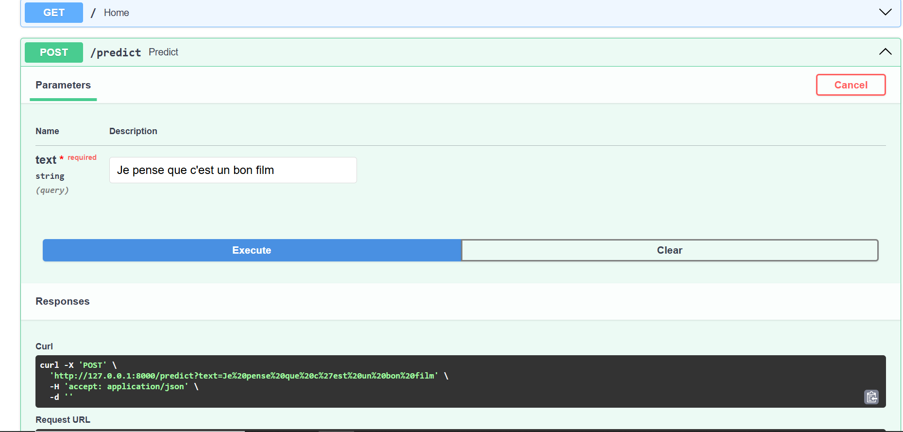
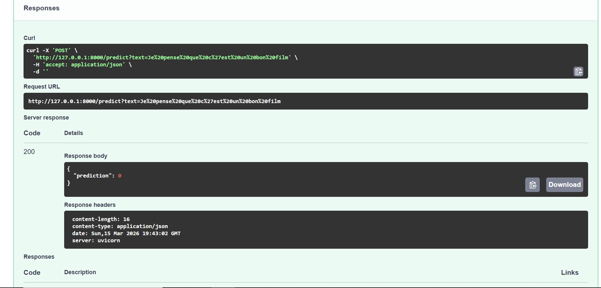

# DataFlowAPI_2025
Review binary classification by Logistic regression.

# Description
This project builds a review classifcation model for the french review using logistic regression.
<br>
It includes: data preprocessing, model training and evaluation with API.

# Features
- Text preprocessing with custom cleaner
- Automated TF-IDF vectorization
- Connection with model by Fast API

# Model / Evaluation Metrics
The model used is **Logistic Regression**, and its performance is evaluated using the **classification report** from `scikit-learn`.

| Class | Precision | Recall | F1-score | Support |
|------|-----------|--------|----------|---------|
| 0 | 0.64 | 0.54 | 0.58 | 5327 |
| 1 | 0.67 | 0.76 | 0.71 | 6673 |
| **Accuracy** |  |  | **0.66** | **12000** |
| **Macro Avg** | 0.66 | 0.65 | 0.65 | 12000 |
| **Weighted Avg** | 0.66 | 0.66 | 0.66 | 12000 |

# Dataset
The dataset contains French reviews with **60,000 rows and 6 columns**.  
For this project, we only keep the two text columns **`review_title`** and **`review_content`**, which are used as input features.

The target variable represents a **binary classification task**; 0 means it is a positive review and 1 means it is a negative review.

# Demo
I used **FastAPI** to create a simple backend for testing the trained model on user-provided review texts.  
This project does **not include a frontend interface**—it consists only of the backend and the model.
Here is a demo of my project

Input text:



Model's answer:


# Project Structure

```
project_name/
│
├── api/                      # FastAPI endpoints
│   └── main.py
│
├── data/   # Training data
│   └── train.csv
│
├── models/      # Stored model and vocabulary         
│   ├── logistic_regression.pkl  # model
│   └── lr_vocab.pkl             # vocab
│
├── notebooks/  # Notebooks
│   └── training_nb.ipynb     # Training notebook
│
├── src/    # Utils
│   ├── data_utils.py         # data preparation functions
│   └── model_utils.py        # model training/prediction?evaluation               
│
└── README.md                 # how to run, inputs/outputs, etc.

```

# Installation

## Clone the repository
git clone https://github.com/sana-mirahsani/DATAFLOWAPI_2025.git

## Install dependencies
pip install -r requirements.txt

# Usage
- Run **main.py**.

# Technologies Used
List key tools and libraries:

- Python 3.10

- Scikit-learn

- Pandas, NumPy 

- FastAPI

# Author
Sana Mirahsani
Master’s student in Machine Learning, University of Lille

Linkind : https://www.linkedin.com/in/sana-mirahsani

Github : https://github.com/sana-mirahsani 